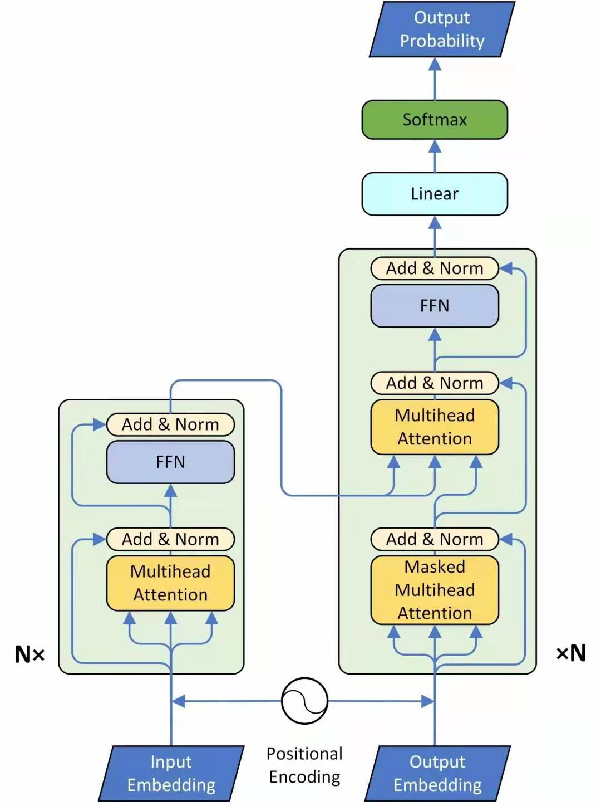
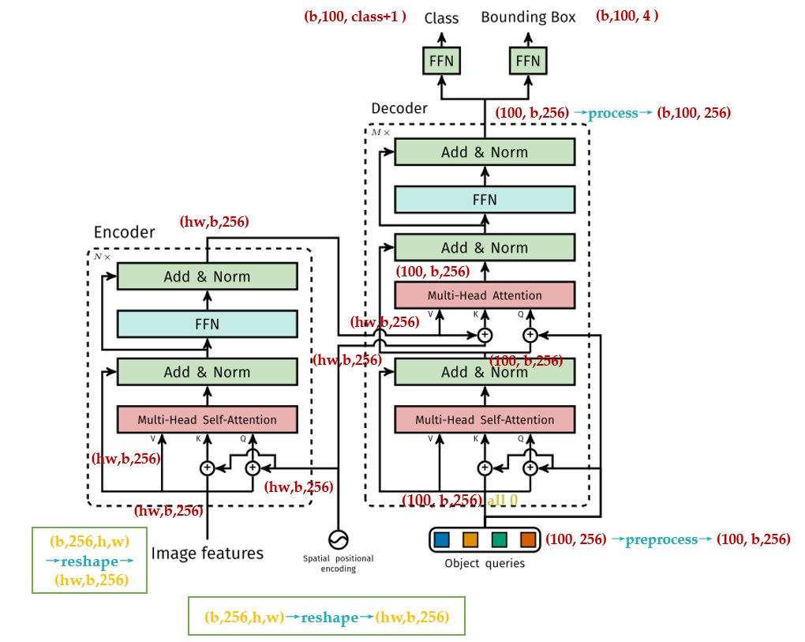
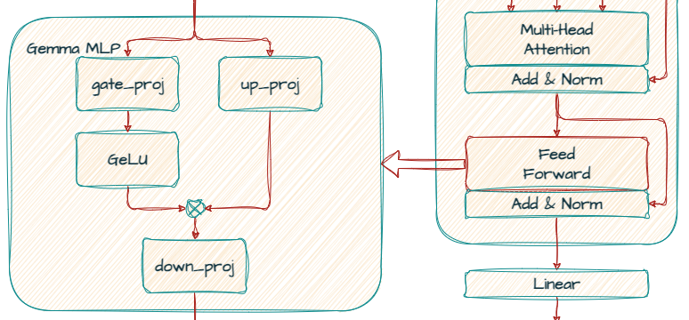

# Paligemma Notes

## From CLIP to SigLIP

Problems with CLIP: Cross entropy loss 
1. into infinity, not numerically stable for calculating exponential results of distribution
2. computational expensive

how to make cross-entropy loss numerically stable?

$$
Softmax = \frac{c\cdot e^{a_i}}{c\cdot \sum_{k=1}^N e^{a_k}} = \frac{e^{a_i + \log c}}{\sum_{k=1} e^{a_k + \log c}}\\  
make \space \log c = - \max_{i} a_i
$$

Code implementation of CLIP:

```python
# image_encoder - ResNet or Vision Transformer
# text_encoder  - CBOW or Text Transformer
# I[n, h, w, c] - minibatch of aligned images
# T[n, l]       - minibatch of aligned texts
# W_i[d_i, d_e] - learned proj of image to embed 
# W_t[d_t, d_e] - learned proj of text to embed 
# t             - learned temperature parameter 

# extract feature representations of each modality
I_f = image_encoder(I)   # [n, d_i] 
T_f = text_encoder(T)   # [n, d_t]

# joint multimodal embedding [n, d_e]
I_e = l2_normalize(np.dot(I_f, W_i), axis=1) 
T_e = l2_normalize(np.dot(T_f, W_t), axis=1) 
# scaled pairwise cosine similaries [n, n]
logits = np.dot(I_e, T_e.T) * np.exp(t)

# symmetric cross entropy loss function
labels = np.arrange(n)
loss_i = cross_entropy_loss(logits, labels, axis=0) 
loss_t = cross_entropy_loss(logits, labels, axis=1)
loss = (loss_i + loss_t) / 2
```


SigLIP:

use sigmoid function to replace softmax loss;

Code implementation of SigLIP:


## Vision Transformer 

For language model, there's a seq2seq transformer model.
<center> 
<p>Transformer structure</p></center>


<center> 
<p>DETR Transformer structure detail</p></center>

## KV_cache


## casual_mask

[bos]（Beginning of Sequence）：序列的开始标记，用于表示一个序列的开始。
[sep]（Separator）：分隔符，用于区分序列中的不同部分，例如在处理两个连续的句子时。
[eos]（End of Sequence）：序列的结束标记，表示一个序列的结束。
[pad]（Padding）：填充标记，用于将序列填充到相同的长度，以便进行批处理


## Gemma decoder model 


resource: https://developers.googleblog.com/en/gemma-explained-overview-gemma-model-family-architectures/

```python 
from transformers import AutoModelForCausalLM
model = AutoModelForCausalLM.from_pretrained("google/gemma-7b")
print(model)
```

Gemma-7B info

```bash
GemmaForCausalLM(
  (model): GemmaModel(
    (embed_tokens): Embedding(256000, 3072, padding_idx=0)
    (layers): ModuleList(
      (0-27): 28 x GemmaDecoderLayer(
        (self_attn): GemmaSdpaAttention(
          (q_proj): Linear(in_features=3072, out_features=4096, bias=False)
          (k_proj): Linear(in_features=3072, out_features=4096, bias=False)
          (v_proj): Linear(in_features=3072, out_features=4096, bias=False)
          (o_proj): Linear(in_features=4096, out_features=3072, bias=False)
          (rotary_emb): GemmaRotaryEmbedding()
        )
        (mlp): GemmaMLP(
          (gate_proj): Linear(in_features=3072, out_features=24576, bias=False)
          (up_proj): Linear(in_features=3072, out_features=24576, bias=False)
          (down_proj): Linear(in_features=24576, out_features=3072, bias=False)
          (act_fn): PytorchGELUTanh()
        )
        (input_layernorm): GemmaRMSNorm()
        (post_attention_layernorm): GemmaRMSNorm()
      )
    )
    (norm): GemmaRMSNorm()
  )
  (lm_head): Linear(in_features=3072, out_features=256000, bias=False)
)
```

* GemmaMLP 

<center>
<p>GemmaMLP Structure</p></center>

In Gemma, the standard ReLU non-linearity is replaced by the GeGLU activation function, a variation of GLU (Gate Linear Unit). GeGLU divides the activation into two parts: a sigmoidal part and a linear projection. The output of the sigmoidal part is element-wise multiplied with the linear projection, resulting in a non-linear activation function.


## Rotary Position Embedding 

RoFormer: Enhanced Transformer with Rotary Position Embedding 